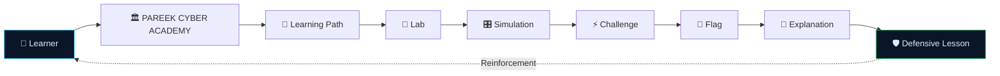

```markdown
<!-- ═══════════════════════════════════════════════════════════════════════
     PAREEK CYBER ACADEMY — README.md
     A single-file, browser-native cybersecurity learning platform.
     ═══════════════════════════════════════════════════════════════════════ -->

```

╭─ PAREEK CYBER ACADEMY ─ SYSTEM BOOT ─────────────────────────────────╮
│  [ OK ]  kernel handshake ................. 0xACADEMY  online        │
│  [ OK ]  curriculum matrix ................ 33 levels / 250+ topics  │
│  [ OK ]  lab environment .................. terminal · web · soc     │
│  [ OK ]  ctf engine ....................... 100+ original flags      │
│  [ OK ]  ethics protocol .................. authorized mode locked   │
│                                                                      │
│  ▸ WELCOME, RECRUIT. THE COMMAND CENTER IS YOURS.                    │
╰──────────────────────────────────────────────────────────────────────╯

```

<div align="center">

# ⬢ PAREEK CYBER ACADEMY

### `LEARN • BUILD • BREAK • DEFEND`

**A browser-native cybersecurity academy — futuristic cyber interface, 33-level roadmap, 250+ topics, interactive labs, and an original in-browser CTF engine. No backend. No build step. One file.**

<br/>

[](#-github-pages-deployment)
[](#-the-a-z-cybersecurity-roadmap)
[](#-cyber-ctf--the-arena)

<br/>


</div>

---

<div align="center">

```

```

</div>

---

## ⚡ What Is PAREEK CYBER ACADEMY?

> **PAREEK CYBER ACADEMY** is a complete, browser-native cybersecurity learning environment — built as a single self-contained `index.html` file that runs entirely on static hosting. There is no backend, no database, no build system, and no tracking. Everything — the cyber command center background, the 33-level roadmap, the interactive labs, the terminal simulator, and the original CTF engine — lives inside one file and executes entirely in the learner's browser.

### ▸ Who It Is For

| Audience | What You Get |
|---|---|
| **Absolute beginners** | A structured path from "what is a CPU" all the way to cloud security architecture |
| **Self-taught hackers** | An ordered curriculum with prerequisites — no more scattered tutorials |
| **Students** | A portfolio-ready learning platform to demonstrate real, practical skill |
| **Professionals pivoting** | Deep dives into SOC, DFIR, cloud, DevSecOps, AI security, and architecture |
| **Educators** | A ready-to-fork teaching environment for workshops and bootcamps |
| **CTF newcomers** | 100+ original, safe, simulated challenges with hints and explanations |

### ▸ Why It Exists

Most cybersecurity learning is scattered, unordered, and disconnected from practice. This platform exists to give learners a **single ordered path** — where every topic has prerequisites, every level has labs, and every concept has a defensive counterpoint. Theory without practice decays. Practice without theory is fragile. This platform enforces both.

---

## 🧭 The A–Z Cybersecurity Roadmap

The academy walks a learner through **33 structured levels**, from how a CPU executes an instruction to how a CISO defends an enterprise. Each level contains topics, labs, tools, skills, and completion criteria.

```mermaid
flowchart TD
    L0[00 · Computer Fundamentals] --> L1[01 · Linux]
    L1 --> L2[02 · Networking]
    L2 --> L3[03 · Python]
    L3 --> L4[04 · Web Technologies]
    L4 --> L5[05 · Cybersecurity Fundamentals]
    L5 --> L6[06 · Cryptography]
    L6 --> L7[07 · Web Security]
    L7 --> L8[08 · API Security]
    L8 --> L9[09 · Operating System Security]
    L9 --> L10[10 · Active Directory Security]
    L10 --> L11[11 · Cloud Computing]
    L11 --> L12[12 · Cloud Security]
    L12 --> L13[13 · DevSecOps]
    L13 --> L14[14 · SOC Operations]
    L14 --> L15[15 · SIEM & Detection]
    L15 --> L16[16 · Threat Intelligence]
    L16 --> L17[17 · Incident Response]
    L17 --> L18[18 · Digital Forensics]
    L18 --> L19[19 · Malware Analysis]
    L19 --> L20[20 · Reverse Engineering]
    L20 --> L21[21 · Mobile Security]
    L21 --> L22[22 · Wireless Security]
    L22 --> L23[23 · Container Security]
    L23 --> L24[24 · Kubernetes Security]
    L24 --> L25[25 · AI Security]
    L25 --> L26[26 · Red Team]
    L26 --> L27[27 · Blue Team]
    L27 --> L28[28 · Purple Team]
    L28 --> L29[29 · Security Engineering]
    L29 --> L30[30 · Security Architecture]
    L30 --> L31[31 · GRC]
    L31 --> L32[32 · CISO Track]
    style L0 fill:#0a1628,stroke:#22d3ee,color:#dfe9f5
    style L32 fill:#0a1628,stroke:#a855f7,color:#dfe9f5
```



<details>
<summary><b>▸ Readable Fallback Roadmap (click to expand)</b></summary>

```text
  00  Computer Fundamentals
   │
   ▼
  01  Linux
   │
   ▼
  02  Networking
   │
   ▼
  03  Python for Cybersecurity
   │
   ▼
  04  Web Technologies
   │
   ▼
  05  Cybersecurity Fundamentals
   │
   ▼
  06  Cryptography
   │
   ▼
  07  Web Security
   │
   ▼
  08  API Security
   │
   ▼
  09  Operating System Security
   │
   ▼
  10  Active Directory Security
   │
   ▼
  11  Cloud Computing
   │
   ▼
  12  Cloud Security
   │
   ▼
  13  DevSecOps
   │
   ▼
  14  SOC Operations
   │
   ▼
  15  SIEM & Detection Engineering
   │
   ▼
  16  Threat Intelligence
   │
   ▼
  17  Incident Response
   │
   ▼
  18  Digital Forensics
   │
   ▼
  19  Malware Analysis (Theory)
   │
   ▼
  20  Reverse Engineering (Theory)
   │
   ▼
  21  Mobile Security
   │
   ▼
  22  Wireless Security
   │
   ▼
  23  Container Security
   │
   ▼
  24  Kubernetes Security
   │
   ▼
  25  AI Security
   │
   ▼
  26  Red Team
   │
   ▼
  27  Blue Team
   │
   ▼
  28  Purple Team
   │
   ▼
  29  Security Engineering
   │
   ▼
  30  Security Architecture
   │
   ▼
  31  GRC — Governance, Risk & Compliance
   │
   ▼
  32  Professional / CISO Track
```

</details>

---

⚡ CYBER CTF — The Arena

The academy ships with an original, browser-based CTF engine — built from scratch as an educational simulation. Every challenge, flag, hint, explanation, and dataset is original. Nothing is copied from TryHackMe, Hack The Box, PortSwigger, or any other proprietary platform.

<div align="center">

```
    ╔══════════════════════════════════════════════════════════╗
    ║                 ◈  PAREEK CYBER CTF  ◈                    ║
    ║              ═══════════════════════════                  ║
    ║                                                          ║
    ║   EASY   ▸ 50 XP     MEDIUM ▸ 100 XP                      ║
    ║   HARD   ▸ 200 XP    INSANE ▸ 400 XP                      ║
    ║                                                          ║
    ║   FLAG FORMAT  ▸  PCA{ ... }                              ║
    ║                                                          ║
    ╚══════════════════════════════════════════════════════════╝
```

</div>

▸ Categories Covered

<table>
<tr>
<td width="50%" valign="top">

Offensive & Web

· Web Security
· API Security
· JWT
· HTTP
· Authentication
· Access Control
· Secure Coding

Systems & Networks

· Linux
· Bash
· Networking
· DNS
· TLS
· Python

</td>
<td width="50%" valign="top">

Defensive & Forensics

· SOC
· Log Analysis
· Threat Hunting
· Incident Response
· Digital Forensics
· Malware Analysis (Theory)
· Reverse Engineering (Theory)

Cloud & Modern

· Cloud Security
· Docker Security
· Kubernetes Security
· AI Security
· Cryptography
· OSINT
· CTF Fundamentals

</td>
</tr>
</table>

▸ Difficulty Progression

Tier XP Typical Skill Level
🟢 Easy 50 First-time learners; reading, encoding, foundational concepts
🔵 Medium 100 Understands systems; can follow multi-step reasoning
🟠 Hard 200 Comfortable with tools; reasons about defence
🔴 Insane 400 Deep knowledge of architecture, detection, and trade-offs

▸ Every Challenge Includes

Element Description
ID & Name Unique identifier + descriptive title
Category & Difficulty Classification for filtering and progression
Description Context and scenario
Mission The specific objective
Hints Progressive hints that reduce the final score
Multi-stage Labs Terminal, log viewer, JWT inspector, packet analysis
Flag Unique PCA{...} string
XP Reward Scaled to difficulty
Explanation What happened and why
Defensive Lesson How defenders detect, prevent, and recover
Related Tools Real-world tools that address the concept

Fair-play disclosure: This CTF engine is a browser-only simulator. Flags are technically retrievable from the source, as they must be for client-side validation. This is intentional and stated openly. For competition-grade server-validated CTFs, learners are directed to independent external platforms. Solving these challenges by reasoning — not by reading the source — is the whole point.

---

🧪 Lab Architecture

Every learning path flows through the same nine-step loop. This is the architecture that turns information into capability.



Readable form:

```text
   Learner
      │
      ▼
   PAREEK CYBER ACADEMY
      │
      ▼
   Learning Path
      │
      ▼
   Lab
      │
      ▼
   Simulation
      │
      ▼
   Challenge
      │
      ▼
   Flag
      │
      ▼
   Explanation
      │
      ▼
   Defensive Lesson
      │
      └─► back to Learner (with new skill)
```

---

🧰 Cyber Toolbox — Documented, Not Just Named

The platform maintains a tool encyclopedia covering 60+ real security tools, each documented with purpose, installation, syntax, safe examples, key flags, output interpretation, and defensive use.

<details>
<summary><b>▸ Reconnaissance</b></summary>

Nmap · Masscan · Amass · Subfinder · httpx · dig / dnsx · whois · theHarvester · Shodan

</details>

<details>
<summary><b>▸ Network Analysis</b></summary>

Wireshark · TShark · tcpdump · Scapy · hping3 · netcat

</details>

<details>
<summary><b>▸ Web Security</b></summary>

Burp Suite Community · OWASP ZAP · Nikto · Gobuster · ffuf · sqlmap (lab only) · WPScan

</details>

<details>
<summary><b>▸ Password Auditing</b></summary>

Hashcat · John the Ripper · Hydra (authorized only)

</details>

<details>
<summary><b>▸ Digital Forensics</b></summary>

Autopsy · Sleuth Kit · Volatility 3 · plaso / log2timeline

</details>

<details>
<summary><b>▸ Reverse Engineering</b></summary>

Ghidra · x64dbg · radare2 · gdb · objdump / readelf · PEStudio

</details>

<details>
<summary><b>▸ Malware Analysis (Theory & Safe Samples)</b></summary>

YARA · Detect It Easy · pefile · strings · Sandbox concepts (CAPE / Cuckoo)

</details>

<details>
<summary><b>▸ Cryptography</b></summary>

OpenSSL · GPG · CyberChef · hashcat (lab)

</details>

<details>
<summary><b>▸ Cloud Security</b></summary>

Prowler · ScoutSuite · Checkov · tfsec · AWS / Azure / GCP CLIs

</details>

<details>
<summary><b>▸ Container & Kubernetes</b></summary>

Docker · Trivy · Grype · Syft · Falco · kube-bench · kube-hunter (own cluster)

</details>

<details>
<summary><b>▸ DevSecOps</b></summary>

Semgrep · Bandit · gitleaks · TruffleHog · OWASP Dependency-Check · GitHub Actions

</details>

<details>
<summary><b>▸ SOC / Blue Team</b></summary>

Sysmon · Zeek · Suricata · Wazuh · Sigma · Velociraptor · TheHive

</details>

<details>
<summary><b>▸ OSINT</b></summary>

crt.sh (Certificate Transparency) · WHOIS · Search operators · exiftool

</details>

<details>
<summary><b>▸ Active Directory (Theory & Lab)</b></summary>

BloodHound (lab) · PingCastle · Purple Knight · ADUC · GPMC

</details>

<details>
<summary><b>▸ Operating System Security</b></summary>

Lynis · auditd · ausearch · CIS Benchmarks · Sysinternals

</details>

<details>
<summary><b>▸ AI Security</b></summary>

Garak · Promptfoo · OWASP LLM Top 10 · NIST AI RMF

</details>

All tool documentation is educational. No workflows are provided for attacking arbitrary public targets. All examples target localhost, home labs, CTFs, or explicitly authorized systems.

---

🛡️ SOC & Blue Team Curriculum

The academy trains defenders with the same rigour it trains attackers. The SOC path covers:

```text
   ┌────────────────────────────────────────────────────────────┐
   │                                                            │
   │   ◈ SOC architecture and tiering (T1 / T2 / T3)             │
   │   ◈ Alert triage discipline and evidence-based reasoning    │
   │   ◈ SIEM ingestion, parsing, correlation, and tuning        │
   │   ◈ Detection engineering with Sigma rules                  │
   │   ◈ Threat hunting via hypotheses from ATT&CK gaps          │
   │   ◈ IOC / IOA extraction and threat intelligence            │
   │   ◈ Incident response lifecycle (PICERL)                    │
   │   ◈ Playbook authoring and runbook discipline               │
   │   ◈ Digital forensics (disk, memory, timeline)              │
   │   ◈ Evidence handling and chain of custody                  │
   │   ◈ Purple team feedback loops                              │
   │   ◈ Metrics — MTTD, MTTR, coverage %, false-positive rate   │
   │                                                            │
   └────────────────────────────────────────────────────────────┘
```

Hands-on SOC experiences include: simulated SIEM alert console, log-analysis viewers, phishing triage exercises, threat hunt reports, incident response simulations, and forensic case studies — all in-browser, all safe.

---

☁️ Cloud + DevSecOps Track

Cloud-native and pipeline security are treated as first-class skills, not afterthoughts.

<table>
<tr>
<td width="50%" valign="top">

▸ Cloud Platforms

· AWS — IAM, VPC, S3, CloudTrail, GuardDuty
· Azure — Entra ID, NSGs, Defender for Cloud
· Google Cloud — IAM, VPC, Security Command Center

▸ Cloud Concepts

· Shared responsibility model
· Identity and least privilege
· Network security groups and segmentation
· Secrets management and key rotation
· Posture assessment (CSPM)
· Cloud incident response

</td>
<td width="50%" valign="top">

▸ DevSecOps Pipeline

· SAST — Semgrep, Bandit
· DAST — ZAP, Burp
· SCA — Dependency-Check, Trivy
· Secrets — gitleaks, TruffleHog
· IaC — Checkov, tfsec, OPA
· Containers — Trivy, Grype, Syft
· SBOM — SPDX / CycloneDX
· Supply chain — SLSA, Sigstore

</td>
</tr>
</table>

---

🤖 AI Security — The New Frontier

The academy treats AI systems as a new class of software with new trust boundaries: prompts are untrusted input, models are supply chain, agents are privilege.

```text
   ┌───────────────────────────────────────────────────────────┐
   │  ◈ Prompt injection (direct and indirect via RAG)         │
   │  ◈ LLM output handling and data exfiltration risk         │
   │  ◈ Model supply chain — pickle deserialisation, hubs      │
   │  ◈ RAG poisoning and tenant isolation failures            │
   │  ◈ Agent and tool abuse — excessive agency                │
   │  ◈ AI threat modelling — STRIDE for AI systems            │
   │  ◈ Guardrails: input filtering, output filtering,          │
   │    monitoring, rate limiting, sandboxing                  │
   │  ◈ Governance — EU AI Act concepts, NIST AI RMF           │
   └───────────────────────────────────────────────────────────┘
```

Focus: defensive testing in authorized environments. The academy teaches you to find and fix, not to harm.

---

🎯 Career Roadmap

The platform ships a career tracks module covering 15 roles. For each role it lists: required skills, tools, certifications, portfolio projects, and typical interview topics — without promising jobs or salaries.

<details>
<summary><b>▸ SOC Analyst</b> — Log analysis, triage, SIEM, MITRE ATT&CK, ticketing</summary>

Skills: Log analysis · Alert triage · Networking fundamentals · Windows/Linux event logs · MITRE ATT&CK · Ticketing discipline
Tools: SIEM · EDR · Wireshark · VirusTotal · TheHive
Certs: Security+ · CySA+ · SC-200
Portfolio: Mini SIEM dashboard · Detection rule library · Phishing triage toolkit

</details>

<details>
<summary><b>▸ Security Engineer</b> — Automation, systems design, cloud, detection</summary>

Skills: Automation · Systems design · Scripting · Cloud platforms · Detection engineering
Tools: Python · Terraform · SIEM · Docker · Kubernetes
Certs: AWS Security Specialty · Security+ · GIAC
Portfolio: Secure CI/CD pipeline · Cloud posture dashboard · Endpoint detection lab

</details>

<details>
<summary><b>▸ Penetration Tester</b> — Authorized offensive security and reporting</summary>

Skills: Methodology · Web and network testing · Reporting · Scoping and legal boundaries · Scripting
Tools: Burp Suite · Nmap · Metasploit (authorized) · Kali Linux
Certs: eJPT · PNPT · OSCP
Portfolio: CTF writeup pack · Secure API with authorization tests · Professional reports

</details>

<details>
<summary><b>▸ Cloud Security Engineer</b> — AWS / Azure / GCP security design</summary>

Skills: Cloud platforms · IAM design · Network security · IaC · CSPM
Tools: Prowler · Terraform · Cloud CLIs · Checkov
Certs: AWS Security Specialty · AZ-500 · GCP PCSE
Portfolio: Cloud posture dashboard · IAM audit script · Zero trust landing zone

</details>

<details>
<summary><b>▸ Application Security Engineer</b> — Secure SDLC and code review</summary>

Skills: Secure SDLC · Threat modelling · Code review · OWASP Top 10 · Developer enablement
Tools: Semgrep · Burp Suite · SAST / DAST platforms · Dependency checkers
Certs: CSSLP · OSWE · Security+
Portfolio: Secure code review guide · SAST rule pack · Threat model library

</details>

<details>
<summary><b>▸ DevSecOps Engineer</b> — CI/CD and supply chain security</summary>

Skills: CI/CD · Policy as code · Supply chain security · Container security · Automation
Tools: GitHub Actions · Semgrep · Trivy · OPA · Cosign
Certs: AWS DevOps · CKA / CKS · Security+
Portfolio: Secure CI/CD reference pipeline · Supply chain framework · Container hardening lab

</details>

<details>
<summary><b>▸ Threat Hunter</b> — Hypothesis-driven proactive searching</summary>

Skills: Hypothesis-driven analysis · ATT&CK · Data analysis · Detection engineering · Adversary knowledge
Tools: SIEM · Velociraptor · Zeek · ATT&CK Navigator
Certs: GIAC GCTI · CySA+ · GCIA
Portfolio: Threat hunt report series · Detection rule library · ATT&CK coverage mapping

</details>

<details>
<summary><b>▸ DFIR Analyst</b> — Digital forensics and incident response</summary>

Skills: Evidence handling · Disk and memory forensics · Timeline analysis · Incident response · Reporting
Tools: Autopsy · Volatility · KAPE · plaso · Velociraptor
Certs: GCFA · GCIH · EnCE
Portfolio: Forensic case study · Memory forensics workflow · IR tabletop kit

</details>

<details>
<summa
